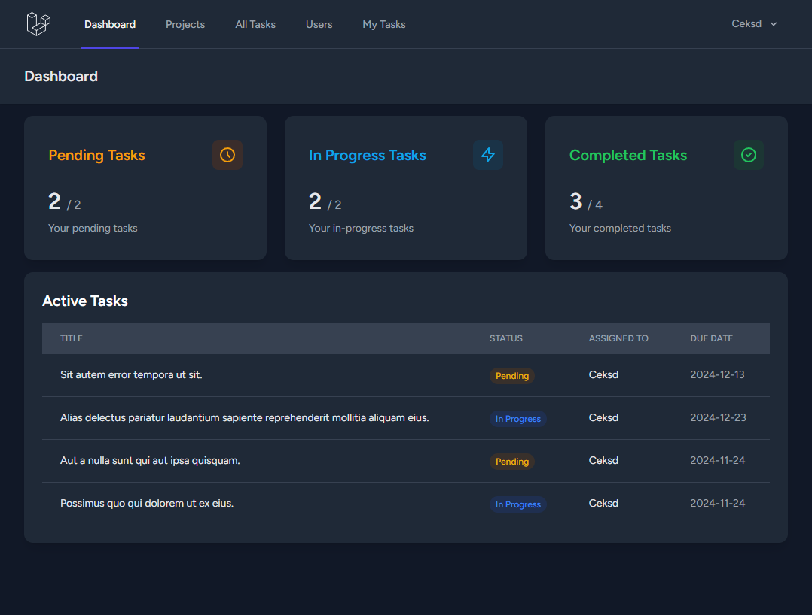

# 🏗️ Project Management System 🌟

Project Management System is a web application built using Laravel, React, and Inertia.js to help teams manage projects efficiently with seamless collaboration and streamlined workflows.


## Badges

 
 


## ✨ Features

- **Dashboard**: Overview of the system with active tasks displayed.
- **Project Tab**: View all projects in one place.
- **Task Tab**: Browse all tasks with detailed information.
- **User Management**: View all users, their details, and create new users.
- **Task & Project Details**: Access detailed views for tasks and projects.
- **Create Functionality**: Create users, tasks, and projects effortlessly.


## 📚 Tech Stack

- **Backend**: Laravel 11.x – Known for its elegance, simplicity, and efficiency.
- **Frontend**: React 18.x – A modern library for building powerful user interfaces.
- **Bridge**: Inertia.js – Connecting the worlds of server and client seamlessly.
- **Database**: MySQL – A powerful relational database for storing and managing data.
- **Styling**: TailwindCSS – Clean, modern, and responsive styles.

## 🚀 Getting Started

### Prerequisites
- PHP (>= 8.1)
- Node.js (>= 18.x)
- Composer
- MySQL
- NPM
- Git

### Installation

#### 1. Clone the repository

```bash
git clone https://github.com/MuhdAfif98/project-management-system.git

cd project-management-system
```

#### 2. Install dependencies:

```bash
composer install

npm install
```

#### 3. Set up environment variables:

```bash
APP_NAME="Project Management System"
APP_URL=http://localhost
DB_CONNECTION=mysql
DB_HOST=127.0.0.1
DB_PORT=3306
DB_DATABASE=your_database_name
DB_USERNAME=your_username
DB_PASSWORD=your_password
```

#### 4. Generate app key:

```bash
php artisan key:generate
```

#### 5. Run migrations along with seeding database:

```bash
php artisan migrate:refresh --seed
```

#### 6. Compile assets:

```bash
npm run dev
```

#### 7. Start the development server:

```bash
php artisan serve
```

## 🎨 Screenshots
 
### Dashboard


## 🛠️ Usage

- Visit http://localhost to start using the system.


## 📂 Project Structure

- **Backend (Laravel):**
&nbsp; &nbsp;&nbsp;&nbsp;&nbsp;&nbsp; Handles all server-side logic, authentication, and database interactions.
- **Frontend (React + Inertia.js):**
&nbsp; &nbsp;&nbsp;&nbsp;&nbsp;&nbsp; Provides a dynamic, single-page application experience.
- **Routes:**
&nbsp; &nbsp;&nbsp;&nbsp;&nbsp;&nbsp; Laravel handles the routing, seamlessly integrating Inertia's views.
## 🎨 Screenshots


